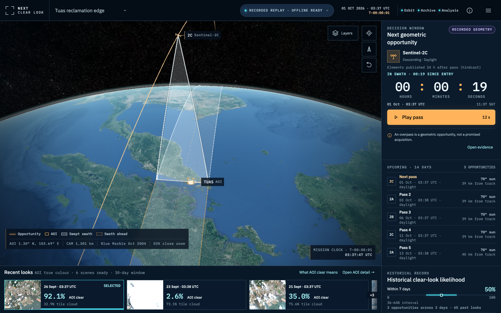
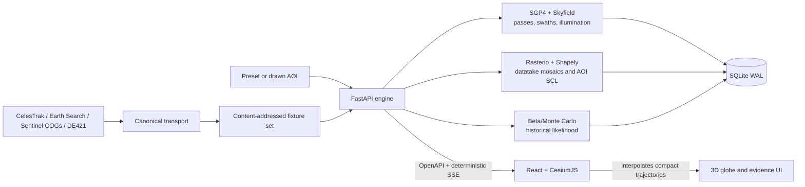
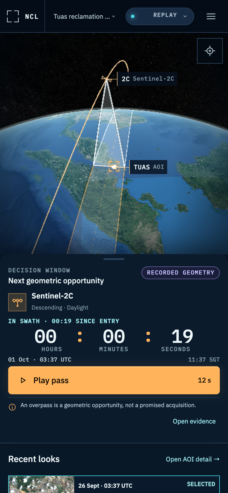

# Next Clear Look

Next Clear Look answers one operational question for a place on Earth: **when does Sentinel-2 next
have a geometric opportunity to see it, and what did the recent clear looks actually show?** An
opportunity is not a promised acquisition, and the historical clear-look likelihood is not a
weather forecast.



The default product is a deterministic recorded replay: a live 3D orbital view, five recorded
AOIs, AOI-clipped Sentinel-2 evidence, native-20 m scene-classification statistics, seasonal
likelihoods with sample sizes and intervals, and provenance links for opportunities, scene
statistics and likelihoods. In live mode you can draw any area on the globe and watch the engine
stream its passes, archive and likelihood as they are computed.

## How it was built

Claude Opus 5.5 orchestrated GPT-5.6 coding agents through the whole build: research, specs,
three parallel implementations and three reviewed polish rounds, with independent Claude reviewers
scoring every round. The record, with the numbers, is in
[`docs/how-it-was-built.md`](docs/how-it-was-built.md).

## Under the hood

- **Pass prediction you can check.** SGP4 from CelesTrak elements, TEME → ITRS → WGS84, a
  290 km MSI swath and descending, sunlit passes only. A golden test replays a recorded Tuas
  window: every real acquisition matches a predicted pass, with a median timing error of about
  0.27 s.
- **Cloud cover for your polygon, not the tile.** Windowed COG reads of the L2A
  scene-classification layer and tiles of one datatake mosaicked on a single AOI grid. Coverage is
  measured against the full AOI, so a pass that only clips the area never counts as a whole look;
  clear % is measured over the valid pixels inside the AOI.
- **Likelihood with its evidence attached.** Two Beta posteriors (does an expected pass get
  acquired, is the AOI clear when it is), combined over the upcoming opportunity days by Monte
  Carlo, reported with a 90% interval and the counts behind it, or not at all when data is thin.
- **Streaming jobs that replay byte for byte.** Analysis runs as a job that streams typed SSE
  events: passes first, then each scene, then the likelihood. In replay, event IDs and timestamps
  derive from inputs, so the same request produces the same stream every time.
- **Offline by construction.** Every upstream request has one canonical identity and lands in a
  content-addressed fixture set; the replay suite runs with network sockets denied.

## Run the recorded replay

```bash
docker compose up --build
```

Open <http://localhost:4173>. The first build downloads locked packages and base images. Once
built, the engine reads checked-in fixtures on an internal Compose network and needs no source
credentials. Bundled NASA imagery supplies the offline globe; when the browser is online it may
add the optional EOX close-zoom layer, but replay readiness never depends on it. Stop the stack
with `docker compose down` (the named replay state volume is preserved).

Compose intentionally pins the engine image to `linux/amd64`, matching the GitHub runner and the
tested runtime image. Docker Desktop can emulate it on Apple Silicon; Colima needs a registered
amd64 builder and emulator.

For local development, install Python 3.12, Node 22, `uv`, pnpm/Corepack, then run:

```bash
make dev       # real replay engine on 4200; app at http://localhost:5173
make stop
```

`make dev` runs the locked dependency bootstrap before starting, so its first use may download
missing Python or JavaScript packages. Once those dependencies are present, the replay data path
uses local fixtures and does not install a browser. Browser setup is deliberately separate:

```bash
make bootstrap-test
```

## What is real in the replay

The checked-in `ncl-showcase` generation was recorded through the engine's own query builders and
scientific pipeline—never hand-authored request payloads.

- Replay clock: `2026-10-01T01:37:48.308302Z`.
- Presets: Singapore/Tuas, Rotterdam, Atacama, Sundarbans and Jakobshavn.
- Recent archive: six mosaicked datatakes per preset, with AOI-clipped PNGs and native-20 m SCL
  accounting.
- Seasonal evidence: 493 deduplicated datatakes across the five AOIs, read from the coarsest SCL
  overview retaining at least 5,000 valid-or-excluded AOI pixels.
- Source material: one policy-cached CelesTrak response, Earth Search catalogue pages, bounded
  Sentinel COG ranges and a 2023–2027 JPL DE421 excerpt.
- Fixture size: 21,043,473 unique referenced bytes; 22,013,420 bytes of fixture material including
  manifests, schemas, examples and goldens, below the 40 MiB gate.

Tuas keeps its original reviewed polygon. Every other AOI is above 100 km² and visibly frames its
named feature; Sundarbans deliberately crosses two MGRS tiles. Exact geometries and per-preset
byte/scene accounting are in [`fixtures/README.md`](fixtures/README.md). No true-colour COG bytes
or seasonal-history COG ranges are committed. History artifacts keep the range hashes and
explicitly say `bytes_bundled: false`. Jakobshavn treats snow/ice as observable surface because
ice is the subject; the other presets keep snow/ice outside the clear-surface classes.

## Architecture



The engine computes orbital geometry, swaths, raster statistics and likelihoods. The browser
animates compact samples and never computes scientific answers. `contracts/openapi.yaml` and
`contracts/events/` are the wire contract. Every upstream request has one canonical identity;
fixture misses fail closed instead of reaching the network.

## Replay versus live

Replay is the default and CI test mode. It verifies fixture hashes, imports the set
into a rebuilt `replay-ncl-showcase.sqlite`, freezes the engine clock and produces deterministic
SSE IDs/timestamps. Drawn AOIs can use the recorded orbital elements, but replay labels their
archive and likelihood as not recorded rather than inventing evidence.

Live mode is an explicit operator action:

```bash
NCL_ALLOW_LIVE=1 make live
```

The engine contacts only three allowlisted source hosts: CelesTrak, Earth Search and Sentinel-2
COG storage. CelesTrak is single-flight, never retried and cached for at least two hours;
catalogue and COG concurrency is bounded. Local development keeps runtime SQLite/cache files
under `.local/`; Compose uses the named `ncl-state` volume. Neither writes runtime state into
`fixtures/`.

## Repository map

- `engine/` — FastAPI service, scientific pipeline, storage and record/replay adapters.
- `web/` — React, TypeScript and Cesium application; real same-origin API by default.
- `contracts/` — OpenAPI, SSE schemas and executable examples.
- `fixtures/` — AOIs, manifests and content-addressed source/derived bytes.
- `tests/` — forced-offline, compose integration, Playwright, axe, visual and performance suites.
- `tools/` — repository, fixture, development and gate utilities.
- `docs/` — algorithms, replay design, attribution, the quality plan and the
  [design decisions](docs/decisions.md) behind them.

## Quality gates

The release command is:

```bash
make bootstrap-test
make ci
```

`make ci` prints one result for every gate and runs them in order:

| Gate | Command | Evidence |
|---|---|---|
| G1 | `make repo-check` | Layout, locks, boundaries, generated files, fixture bytes |
| G2 | `make contract-check` | OpenAPI/SSE schemas, examples and generated TypeScript |
| G3 | `make engine-static` | Ruff format/lint and strict mypy |
| G4 | `make engine-unit` + `make engine-coverage` | Unit suite; whole-suite 85% branch coverage and critical-module 100% |
| G5 | `make engine-property` | Deterministic Hypothesis geometry/interface properties |
| G6 | `make engine-golden` | Pass-prediction and acquisition-time regression goldens |
| G7 | `make fixtures-check` | Hashes, lineage, raster re-derivation and byte budgets |
| G8 | `make offline-check` | Dead proxies plus denied non-loopback sockets |
| G9 | `make api-contract` | Real ASGI responses/errors and deterministic SSE |
| G10 | `make web-check` | ESLint, strict TypeScript, generated diff and Vitest |
| G11 | `make integration` | Real web/API, SQLite WAL, fixtures and SSE through offline compose |
| G12–G13 | `make e2e-desktop`, `make e2e-mobile` | Required flows at 1440×900 and 390×844 |
| G14 | `make screenshots-check` | Reviewed DOM baselines; WebGL masked; ≤1% difference |
| G15 | `make a11y` | Axe plus keyboard/focus/reduced-motion/reflow checks |
| G16 | `make perf` | Ready/LCP/CLS, endpoint latency and initial-JS budgets |
| G17 | `make compose-smoke` | Production images and healthy offline smoke |

Frame rate and long tasks are GPU-sensitive, so they remain report-only measures:

```bash
make perf-local
```

## Refreshing fixtures

Recording is the only workflow allowed to make the bounded source calls:

```bash
make fixtures-record PRESET=all CLOCK=<recording-instant-UTC>
make fixtures-diff PRESET=singapore-coast
make fixtures-check
```

The recorder searches backward by at most 72 hours and chooses the latest `frozen_at` whose next
Tuas opportunity is two to four hours later; `CLOCK` is the recording instant, not a replay-clock
override. If publication fails after source validation, fix the issue and rerun promptly with
`RESUME=1` to use the durable source cache without another CelesTrak call. A code-only
regeneration can also pass `FROZEN_AT=<existing-frozen-at>` to preserve a reviewed replay clock.
Review the semantic diff and the 40 MiB/per-category report before committing.

## Data sources and licences

- CelesTrak GP/OMM orbital elements — cached and attributed; follow CelesTrak's redistribution and
  query policies.
- Earth Search by Element 84 — STAC catalogue for `sentinel-2-l2a`.
- Contains modified Copernicus Sentinel data — Sentinel-2 L2A COGs on AWS.
- JPL DE421 — the bundled 2023–2027 ephemeris excerpt.
- NASA Blue Marble: Next Generation and Black Marble 2012 — bundled day/night globe imagery.
- EOX Sentinel-2 cloudless 2024 — optional online close-zoom enhancement, CC BY-NC-SA 4.0.
- CesiumJS — Apache 2.0; no Cesium ion service or token is used.

The API is the source of data attribution displayed by the app. Exact wording, URLs and image
licences are maintained in [`docs/attribution.md`](docs/attribution.md).

## Licence

The application code is available under the [MIT License](LICENSE). Recorded source responses and
imagery retain their own terms and attribution requirements; see
[`docs/attribution.md`](docs/attribution.md) before redistributing them.

## Known limits

The current release has no accounts, alerts, notifications, weather forecast,
Sentinel-1/Landsat support, global bulk index or satellite tasking. Geometric opportunities can be
missed acquisitions; historical likelihoods can be unrepresentative of future cloud. Seasonal
sample size, uncertainty and source age remain visible so those limits are inspectable rather than
hidden.

Keep locks frozen, never refresh fixtures/goldens in CI, and never commit credentials, signed URLs
or personal request metadata. Report security issues privately to the repository owner.

<picture>
  <source media="(max-width: 600px)" srcset="docs/images/replay-mobile.png" />
  
</picture>
