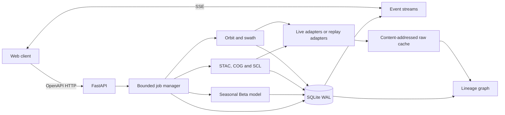

# Next Clear Look engine architecture

Status: implemented engine design, checked against the code and recorded evidence on 2026-10-03 UTC. It describes the service and fixture derivation path; visual presentation is specified elsewhere.

## Architectural stance

The engine is a local-first Python 3.12 service. FastAPI owns the HTTP and SSE contract; CPU and network work run as bounded, cancellable jobs; SQLite in WAL mode stores state and lineage; immutable bytes live in a content-addressed cache. Replay is the default mode and performs no network access. Live mode uses CelesTrak, Earth Search and Sentinel-2 COGs through explicit adapters.

An opportunity is only a geometric event. A likelihood is only a historical empirical rate. Neither is a tasking commitment or weather forecast.



## Component boundaries

- **API:** request validation, pagination, idempotency, errors, binary thumbnail delivery and SSE resumption. It never performs orbit or raster work inline.
- **Job manager:** deduplicates work, schedules stages, applies concurrency limits, persists events before publishing them, handles cancellation and exposes partial results.
- **Analysis workflow:** `analysis/workflow.py` runs catalogue, orbit, archive, raster and likelihood as named stage methods; `service.py` delegates jobs and remains focused on resources and persistence.
- **Product builders:** `analysis/products.py` is the single construction point for scene statistics and likelihood payloads in both live analysis and fixture recording.
- **Orbit service:** validates OMMs, propagates SGP4, transforms frames, samples compact trajectories, constructs the nominal MSI swath and finds AOI intersections.
- **Archive service:** queries Earth Search, reconciles STAC `platform` values and selects all tiles needed to cover an AOI/acquisition.
- **Raster service:** reads only intersecting COG windows/overviews, rasterises the AOI, computes SCL counts and writes clipped RGBA true-colour thumbnails.
- **Likelihood service:** constructs seasonal historical opportunity-day trials and derives Beta-posterior horizon probabilities with a deterministic Monte Carlo interval.
- **Mode adapters:** expose the same typed interfaces for `live` and `replay`. Domain code cannot branch on HTTP or filesystem fixture details.
- **Storage and provenance:** one SQLite writer plus concurrent readers, immutable raw objects and derived-cache manifests. Every API number has a provenance root.

## Implemented `engine/` module layout

```text
engine/
├── pyproject.toml
├── src/ncl_engine/
│   ├── main.py                 # app factory; no import-time I/O
│   ├── runtime.py              # mode-specific clock, store, adapters and job manager
│   ├── service.py              # resource operations and workflow delegation
│   ├── pipeline.py             # recorder and fixture-stat verification callbacks
│   ├── healthcheck.py
│   ├── config.py               # validated env/file settings
│   ├── api/
│   │   ├── dependencies.py
│   │   ├── errors.py
│   │   ├── pagination.py
│   │   └── routers/            # aois, satellites, scenes, jobs, mode, health
│   ├── analysis/
│   │   ├── workflow.py         # named catalogue/orbit/archive/raster/likelihood stages
│   │   └── products.py         # shared statistics and likelihood payload builders
│   ├── domain/
│   │   ├── models.py           # IDs, UTC instants, value objects
│   │   ├── clock.py            # Clock protocol, SystemClock, FrozenClock
│   │   └── policies.py         # limits and honesty labels
│   ├── orbit/
│   │   ├── omm.py              # validation and platform reconciliation
│   │   ├── propagation.py      # SGP4 and frame transformations
│   │   ├── sensor.py           # MSI nominal swath geometry
│   │   ├── intersection.py     # coarse scan and event refinement
│   │   ├── illumination.py     # pinned ephemeris and solar thresholds
│   │   └── trajectories.py
│   ├── raster/
│   │   ├── stac.py
│   │   ├── selection.py
│   │   ├── cog.py
│   │   ├── scl.py
│   │   └── thumbnails.py
│   ├── likelihood/
│   │   ├── trials.py
│   │   ├── history.py
│   │   ├── beta.py
│   │   └── hindcast.py
│   ├── jobs/
│   │   ├── manager.py
│   │   ├── stages.py
│   │   ├── cancellation.py
│   │   └── events.py
│   ├── sources/
│   │   ├── protocols.py        # OMM, STAC, ranged-asset interfaces
│   │   ├── live.py
│   │   ├── replay.py
│   │   └── transport/          # canonical request, fixture, cache and range-read seam
│   ├── fixtures/               # record/check/diff CLI
│   ├── storage/
│   │   ├── sqlite.py
│   │   ├── repositories.py
│   │   └── migrations/
│   └── provenance/
│       ├── cache.py
│       ├── lineage.py
│       └── hashing.py
└── tests/
    ├── unit/
    ├── contract/
    ├── property/               # antimeridian/pole/geometry invariants
    └── golden/                 # pass, hindcast and wire-stability evidence
```

No generated STAC client or database ORM is required for v1. SQL remains explicit and Pydantic response types are checked against `contracts/openapi.yaml` in CI.

## Request and data flow

1. `POST /v1/aois` canonicalises and validates GeoJSON, computes a geometry hash and persists the AOI.
2. `POST /v1/analysis-jobs` computes a request fingerprint from job type, AOI geometry hash, mode, effective clock, algorithm versions and source-set version. An identical active/succeeded job can be returned instead of duplicated work.
3. The catalogue stage resolves the current OMM edition and STAC window through the selected mode adapter. Raw responses are committed before parsing.
4. The orbit stage emits each refined opportunity as soon as it is persisted. The web receives compact one-minute trajectory samples separately and interpolates them.
5. The archive/raster stages run up to four independent datatake analyses concurrently and emit
   each scene statistic and thumbnail as soon as that datatake is ready. A failed scene is a
   warning plus per-scene error; it does not erase successful scenes.
6. The likelihood stage evaluates every seasonal datatake with the same four-worker bound,
   restores catalogue order before calculating the posterior, and emits only after the recent
   scene results. The shared product builder records excluded trials, policy and fallback tier.
7. The final transaction marks the job terminal and emits exactly one terminal event.

Read endpoints never trigger hidden upstream calls. Missing derived data returns `202` with a job link when the endpoint supports lazy analysis, or `404/409` as specified by the contract.

## Async job model

### Queueing and bounded concurrency

One process is sufficient for v1. `asyncio` owns orchestration; CPU-heavy propagation runs in a bounded thread/process executor because Skyfield/NumPy release behavior must not be assumed.

| Resource | Limit | Queue/timeout policy |
|---|---:|---|
| Accepted non-terminal jobs | 64 | Reject with `429 JOB_QUEUE_FULL`; include `Retry-After` |
| Full-analysis jobs | 2 | FIFO within priority; replay jobs do not bypass limits |
| Orbit CPU stages | `min(2, cpu_count)` | Work in one-satellite or ≤6-hour chunks |
| CelesTrak requests | 1 | Single-flight; one group fetch per two hours |
| STAC catalogue requests | 2 | Shared async limiter across pagination and jobs |
| COG datatake workers | 4 | Shared by recent native-resolution and seasonal overview analysis |
| Concurrent COG HTTP ranges | 4 total | Shared async limiter; do not create a connection per block |
| SQLite writers | 1 | Short transactions through one async writer queue |

Progress weights for `full_analysis` are catalogue 5%, orbit 25%, archive selection 10%, raster/thumbnail 45%, likelihood 10%, finalisation 5%. For a smaller job type, included stage weights are renormalised. Progress is monotonic and terminal jobs report `1.0` only after their last transaction commits.

### State machine and cancellation

`queued → running → succeeded | failed | cancelled`. A running job may enter `cancelling` as an API projection while its durable state remains `running` with `cancel_requested_at` populated. `DELETE /analysis-jobs/{id}` is idempotent.

Cancellation is cooperative and checked:

- before each stage and satellite;
- between propagation chunks and refinement candidates;
- before each COG range/window and after each read;
- between Monte Carlo batches;
- before every commit and emitted result.

An in-flight HTTP request receives task cancellation and a short close timeout. Completed immutable cache objects remain valid. Incomplete temporary objects have no manifest and are removed on startup. Partial derived rows are kept only when marked complete individually. A cancelled job emits one `job.cancelled` event and never later emits `job.completed`.

### SSE ordering and recovery

Every event is inserted in `job_events` in the same transaction as the state/result it announces. `(job_id, sequence)` is unique and monotonically increasing. Only then is it placed on the in-memory fan-out bus. `Last-Event-ID` replays persisted events and closes the DB-to-live race by subscribing first, rereading the high-water mark, then draining. Heartbeats are comments and are not persisted. The detailed wire contract is in `contracts/events.md`.

## Caching and provenance

### Raw inputs

Raw bytes are stored at `cache/sha256/<first-two>/<full-sha256>`. A request pointer records method, canonical URL, request-body hash, response hash, fetch time, status, media type, ETag, Last-Modified and expiry. The pointer is mutable; the object is not.

- CelesTrak group results are fresh for two hours and are never fetched more frequently. A new body becomes a new object.
- STAC POST responses are keyed by canonical JSON request and kept as evidence even after refresh.
- JPL ephemerides are pinned by hash and fixture manifest.
- COGs are not downloaded in full. Each returned range is stored as an immutable blob; a range manifest binds asset URL, strong ETag/version, byte interval and blob hash. Ranges with a changed validator cannot be combined.

Temporary downloads use `cache/tmp/<uuid>` and are atomically moved only after their hash and expected length pass. A per-key async lock prevents a cache stampede.

### Derived cache and lineage

The derived key is:

```text
sha256(canonical-json({
  artifact_type, algorithm_version, normalized_parameters,
  ordered_input_hashes, geometry_hash, effective_clock
}))
```

Each derived row stores that key and a provenance node. Edges identify all raw/derived inputs. Numeric API responses expose a `provenance_id`; the graph contains source URL, fetch timestamp, content hash/validator, code/algorithm version, parameters, AOI hash, clock and output hash. Recomputing with identical inputs must produce identical canonical JSON (PNG encoder/version is part of the thumbnail algorithm version).

## SQLite operation

`schema.sql` is the canonical v1 schema. Startup applies `PRAGMA foreign_keys=ON`, `journal_mode=WAL`, `synchronous=NORMAL` and a 5-second busy timeout. One connection serialises writes; a small read pool serves API reads. Long raster/orbit work never holds a transaction. Workers stage results in memory/files, then commit metadata plus provenance atomically. Daily `wal_checkpoint(PASSIVE)` and bounded retention prevent an unbounded event table; active/recent job events are never pruned.

## Live and replay modes

Mode is selected at startup and may be changed through the explicit mode endpoint only when no job is running. A switch cancels queued work, closes live streams with `mode.changed`, swaps the adapter set and resets the clock source; it does not rewrite historical rows.

All domain code receives a `Clock` protocol:

```python
class Clock(Protocol):
    def now(self) -> datetime: ...       # aware UTC only
```

`SystemClock` supplies UTC decision instants in live mode. `FrozenClock.advance_to()` is a concrete-class replay/test control and is deliberately absent from the protocol. Heartbeats, retries, rate limits and timeouts use event-loop monotonic time. Direct `datetime.now()` is forbidden outside clock/bootstrap and source-retrieval evidence code. Randomised algorithms derive a seed from AOI hash, effective clock and model version.

Replay is the default, sets `network_enabled=false`, and fails closed if a fixture is missing. It never silently falls through to live. The API, database writes, job state machine and SSE ordering are identical in both modes; only sources and clock differ.

## Failure handling

| Failure | Behaviour visible to the client |
|---|---|
| CelesTrak slow/unavailable | One request only, no retries; use a cached OMM up to 24 h old with a `STALE_OMM` warning, otherwise fail orbit stage |
| CelesTrak OMM too old | Continue up to configured 24 h ceiling, expose age and widen warning; never label result current beyond ceiling |
| Earth Search slow/unavailable | Connect 5 s, total 30 s, two retries; serve cached query with age warning or mark archive stage failed while preserving orbit results |
| COG range timeout/5xx | Per-request 30 s, two retries only before accepting a body; verify length/ETag; mark that scene failed and continue |
| Invalid/non-range COG response | Reject unexpected full-object `200` over size ceiling; no accidental 300 MB download |
| Corrupt raster/CRS | Scene-level structured error with asset/provenance; no statistic is stored |
| SQLite busy/disk full | Retry bounded busy errors; disk-full makes readiness unhealthy and prevents new jobs, never drops committed evidence |
| Worker crash | Startup marks orphaned `running` jobs failed with `ENGINE_RESTARTED`; complete raw objects remain reusable |
| Client disconnect | Job continues unless explicitly cancelled; SSE can resume by event ID |

Retries are idempotent, bounded and recorded. Circuit breakers open per upstream after five consecutive retryable failures for 60 seconds. API errors use stable codes and `retryable`; raw upstream text is logged, not exposed.

## Performance and resource budgets

Target laptop: Apple Silicon, four available cores, 8 GB free RAM, broadband connection. p95 is measured over 30 warm runs unless marked cold-live.

| Operation | Budget |
|---|---:|
| `/health`, `/mode` | 50 ms p95 |
| AOI CRUD and cached list/detail APIs | 100 ms p95 |
| Cached opportunities/scenes/likelihood | 150 ms p95 |
| Cached 180-minute compact trajectory | 200 ms p95; ≤250 KiB JSON per satellite |
| Job acceptance and first `job.accepted` event | 150 ms p95 |
| Persist-to-SSE delivery for a result | 250 ms p95 |
| Replay first result / full precomputed job | 250 ms / 1.5 s p95 |
| New AOI, warm OMM, first opportunity streamed | 3 s p95 |
| New AOI, three satellites, 20 d past + 14 d future orbit stage | 10 s p95 |
| Cold-live first AOI scene statistic + thumbnail | 12 s p95 |
| Cold-live three-scene raster stage | 35 s p95 |

Spike baselines were 6.785 s for the entire three-satellite 34-day orbit/hindcast run, 5.932–7.350 s per raster scene, and 25.908 s end to end for the three-scene raster run. The COG run transferred 11,215,940 response-body bytes. These are evidence, not an SLA sample. A job exceeding 60 s emits progress/warnings rather than appearing stuck.

Memory budgets are 512 MiB steady-state API, 1.5 GiB total with four raster workers, ≤1.5 million SCL pixels per scene read, and 640 px on the thumbnail long edge (with recorder fallback to 512/384 only to satisfy the fixture budget). Cache defaults to 5 GiB with LRU deletion of unreferenced ranges/derived artifacts; provenance-referenced raw objects are pinned by the fixture/export policy.

## Interfaces with companion components

### Web client

- Consume `contracts/openapi.yaml` and `contracts/events.md` without private fields.
- Interpolate compact WGS84 trajectory samples client-side; do not request frame-rate positions.
- Treat thumbnail URLs as binary PNGs and statistics/provenance as separate resources.
- Display the supplied caveat/quality/sample-size fields without relabelling opportunities or likelihoods.
- Render the display text and terms links from `/v1/attributions`.
- Resume SSE using `Last-Event-ID` and tolerate partial scene results followed by warnings.

No UI component, layout or visual styling is specified here.

### Fixture publisher

- Provide a versioned fixture-set manifest with effective clock, source request identity, content hash, byte length/media type and all content-addressed blobs/range manifests needed by the source protocols.
- Provide an ordered replay-event schedule and source lookup outcomes (including recorded failures) without changing the engine's job/event schemas.
- Guarantee replay startup can verify every manifest hash before readiness becomes `ok`.
- Preserve source attribution/licence text for CelesTrak, Element 84 Earth Search, Copernicus Sentinel data and JPL ephemeris data.

The engine consumes the published fixture format through these interfaces and verifies hashes before readiness.

## Security and input limits

AOIs accept Polygon/MultiPolygon only, valid WGS84 coordinates, at most 10,000 vertices, at most 250,000 km² and no unwrapped span over 180° after normalisation. User URLs are never fetched. Live hosts are allowlisted. Responses set content types, immutable thumbnail ETags and conservative CORS configured for the local web origin. Logs redact query credentials even though v1 sources are keyless.
